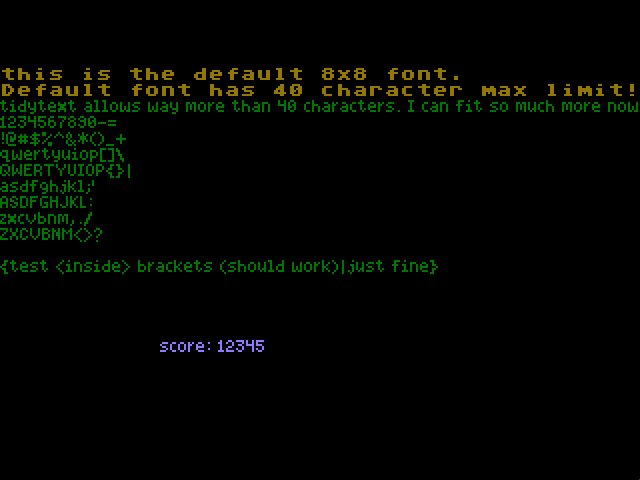

# tidytext
sgdk font kerning system



## what it does

tidytext is a variable-width font rendering system for sega genesis development kit (sgdk). instead of using fixed-width characters where every letter takes up the same amount of space, tidytext allows you to define custom widths for each character. this means narrow characters like 'i' and 'l' can be 3 pixels wide while wider characters like 'm' and 'w' can be 5 pixels wide. the result is that you can fit significantly more characters on screen or per line compared to traditional fixed-width fonts, making better use of limited screen space on the genesis.

## how it works

tidytext takes a custom font tileset where all characters are aligned to the left side of each 8x8 tile. the width of every letter is manually defined in a lookup table in the code. when text is drawn, the system reads each character from the font tileset, masks out any pixels beyond the character's defined width, and then packs multiple characters into 8-pixel-wide tiles sequentially. characters can span across tile boundaries if needed, and a configurable padding (default 1 pixel) is added between characters.

the system works by:
- reading character data from your font tileset (characters must be left-aligned in their tiles)
- looking up each character's width from the manually defined width table
- masking the character data to only include pixels 0 through (width-1), clearing everything beyond
- packing characters sequentially into output tiles, with each character starting right after the previous one plus padding
- when a character would exceed the 8-pixel tile boundary, it automatically wraps to the next tile
- the packed tiles are then loaded into vram and drawn to the screen

this approach allows characters to use only the space they actually need, rather than forcing everything into a fixed 8-pixel width. the width definitions are stored in the charWidthLookup array in `tidyText.c`.

## how to use in your own project

to use tidytext in your project, first copy the `tidyText.h` header file and `tidyText.c` source file into your project. you'll also need to create a font tileset resource with your characters left-aligned...just use the included `res/fonts/tidyText_font_01_short.png` as a base.


### drawing text

tidytext provides two main functions for drawing text:

**tidyText_Single** - draws a single formatted string (supports printf-style formatting):
```c
tidyText_Single(x, y, plane, palette, primaryPaletteIndex, secondaryPaletteIndex, "score: %u", score);
```

**tidyText_Multi** - draws multiple lines of text from an array:
```c
const tidyTextStringStruct lines[] = {
    {"first line"},
    {"second line"},
    {NULL}  // must end with NULL
};
tidyText_Multi(x, y, plane, palette, primaryPaletteIndex, secondaryPaletteIndex, lines);
```

parameters:
- x, y: tilemap coordinates where text should be drawn
- plane: which background plane to draw on (BG_A, BG_B, etc)
- palette: which palette to use (0-3)
- primaryPaletteIndex: remaps palette index 1 in font to this index (0-15)
- secondaryPaletteIndex: remaps palette index 2 in font to this index (0-15)

### resetting

call tidyText_Reset() when you want to clear the tile cache and start fresh. this is useful between frames or when switching screens.

### palette remapping

the font tileset should use palette indices 0 (transparent), 1 (primary color), and 2 (secondary/antialias color). tidytext automatically remaps index 1 to your primaryPaletteIndex and index 2 to your secondaryPaletteIndex when drawing, allowing you to change text colors at runtime without modifying the font data.

### defining character widths

edit the charWidthLookup array in `tidyText.c` to define the width of each character in pixels. widths must be between 1 and 8 pixels (characters must fit within a single tile). characters not defined in the lookup table will default to 8 pixels wide. for example:
```c
['i'] = 3,   // narrow character
['m'] = 5,   // wide character
[' '] = 2,   // space character
```
